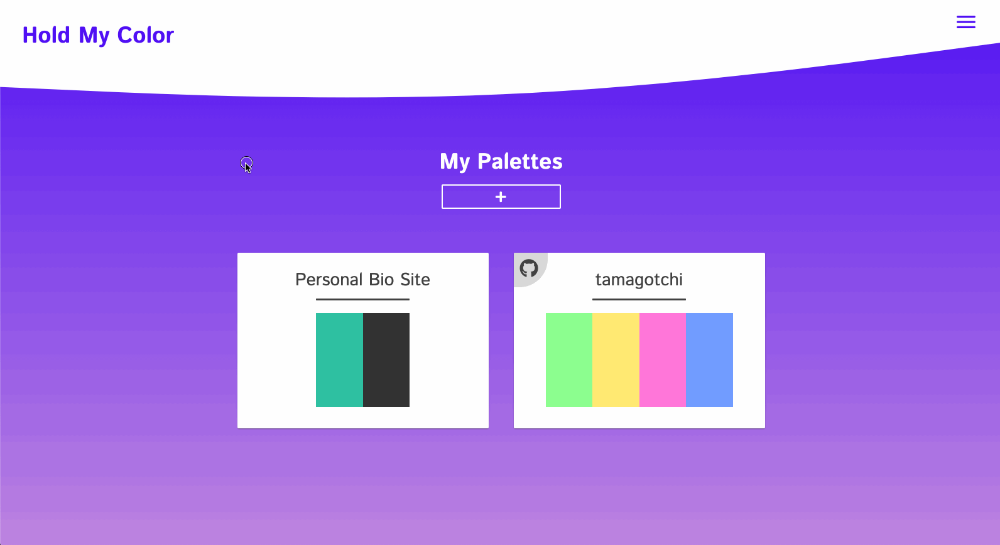
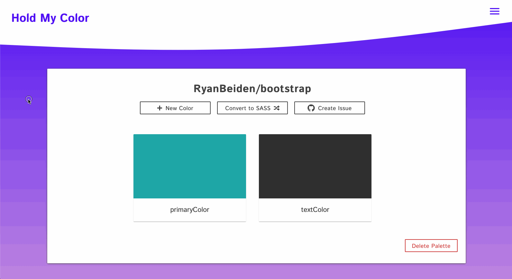

# Hold My Color 🍻

**Build your color palettes with ease.** Hold My Color is a web app where a user not only builds their color palette perfect to their next project, but can take that palette and download it in a `SASS` file or even create their _style guide_ as a Github Issue.

## Authentication

#### Google
As a user, when you sign in through Google, this allows you to create your first palette. From there, you can use the color picker to add new colors. Spaces are restricted in naming the colors so your `SASS` download is created properly. You of course can edit the palette name, the colors and their names as well as completely delete them. 

#### Github
As a user, when you sign in through Github, you receive the same features as a Google user, and then some! When creating a new palette, you have the option to connect it to an existing repository (that the web app retrieved upon sign-in and authorization). This name cannot be changed unless you unlink the repository. After colors are added, you have the option to convert to a `SASS` file as well as create a Github issue. Many times when I start a new project I create my style guide and add it as an issue to the repositories project. Now, I can simply click the **Create Issue** button and it adds the issue to the linked repository in a markdown format ready to be referenced! Palettes will also be marked with a Github logo if they are linked.

## Preview

#### New Palette & Color

---

#### Export Palette

## Deployed Project

[HoldMyColor.com](https://holdmycolor.com/)

## Clone the Repository
- Clone it 👉🏼 `$ git clone https://github.com/RyanBeiden/hold-my-color.git`

- Install the dependencies 👉🏼 `$ npm install`

- Run `$ npm start`

## Technologies Used
     

#### Backlog/Roadmap

- Clear Colors Button
